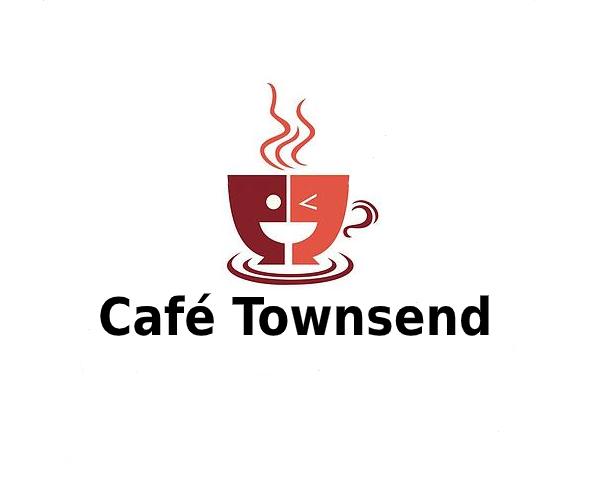

# cafeTownsend_Test
This project was created to perform web application tests using selenium.

### Tools

This project was developed using:
- **Ruby**: to write the code;
- **Selenium WebDriver**: drives a browser natively, as a real user would.
- **Cucumber**: to create executable specifications; 
- **Capybara**: to simulates scenarios for user stories; 
- **Rspec**: Dsl testing tool written in Ruby to test Ruby code to validade the expected results;
- **SitePrism**: It's a DSL (Domain Specific Language) designed to make it easy to create page objects for automated  testing using Capybara.

CafeTownsend Tests uses only open-source tools to atend your needs without any major effort. 

## Structure of the project

```
Project
├── config 
│   └── cucumber.yml
├── features
│   ├── functions
│   ├── specs
│   │   └── BDD
│   ├── step_definitions
│   │   └── Tests
│   ├── suport
│   │   └── env.rb
│   │   └── api.yml
│   └── reports
│       ├── shots
│       │   └── screenshots
│       └── HTML Report   
├── .gitignore
├── Gemfile
└── README.md
```

All the tests results are saved inside the *report* folder.  

# Requirements

Before running the tests, please install:

[ruby](https://rvm.io/rvm/install)  
[bundle](https://bundler.io/)
[ChromeDriver](https://tecadmin.net/setup-selenium-chromedriver-on-ubuntu/)  
[GeckoDriver](https://github.com/mozilla/geckodriver/releases)

### Note on Settings

The main setting file it is at `config/cucumber.yml`.  
 

# Installation  

Install all of the required gems from your specified sources.  

```               
$ bundle                                             
```  
It is possible to find some problems installing the gem set, in this case, separately install the gem with trouble and back to bundle command.  

## Project configuration

The `config/cucumber.yml` file contains the project configuration.  
All the others settings can be found at `features/support`. 

By default:
- the tests will run using Google chrome;
- the report will be saved in HTML format;
- the terminal shows a short version of the scenarios.

If you want to run using Chrome Headless it is necessary to change the default tag. Check some examples:

To use Chrome Headless:
```
default: --format pretty -p html -p chrome_headless
````

To save the report in json format:
```
default: --format pretty -p json -p chrome_headless
```

To check more information about the scenarios in the terminal:
```
default: --format progress -p html -p chrome_headless
```

## Running tests

You can run the tests any time. All you need to do is:

```
$ cucumber                                           
```
The *cucumber* command perform every test in your project at once.

If you want to run a specific test, run: 

```
$ cucumber -t @createdtag                             
```
**Note:** *createdtag* is the given name to your test suite. Example: *@createUser or @deleteUser*.

